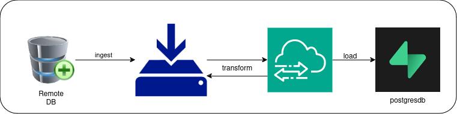

## ETL pipleine for Agriculture data

### Challange
You are required to use Pandas for data wrangling. You can use any library of your choice to connect with the database. SQLAlchmemy and psycopg2 are good candidates.

Create an account in Supabase. NOTE - Supabase is just a hosted remote postgres database. Create a database, and name it agricultural-data. Create a table and name it cleaned_agric_data. Your cleaned data will be loaded in this table.

## My Approach.
Extract from a remote postgresDB,
Ingest it  locally as shown [here](load_data.py).

[Transform](transform_data.py) the data by removing columns full of empty data, duplicates and changing the datatypes.

Load to Supabase - https://supabase.com/docs.
Create a database, a table and [load the data](load_data.py).