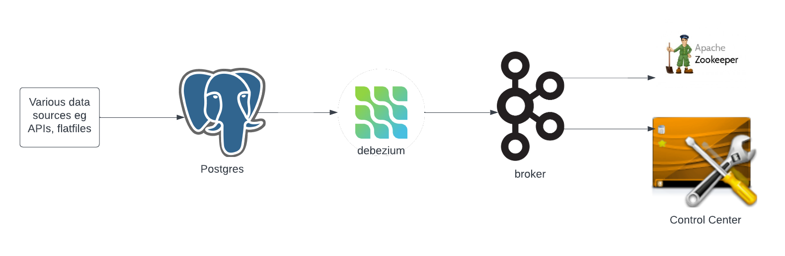
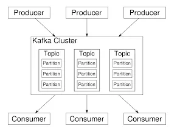
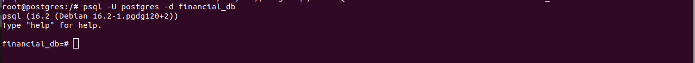
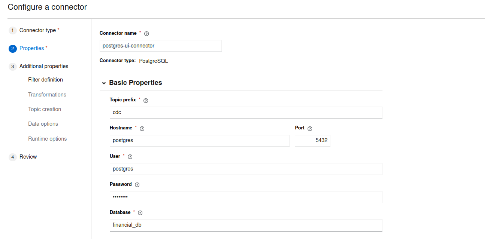
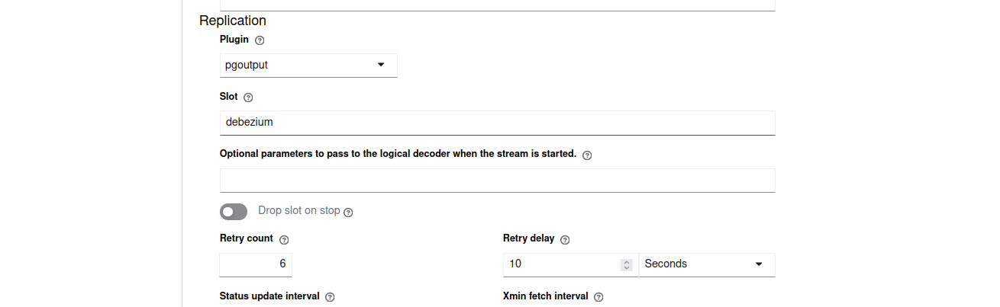
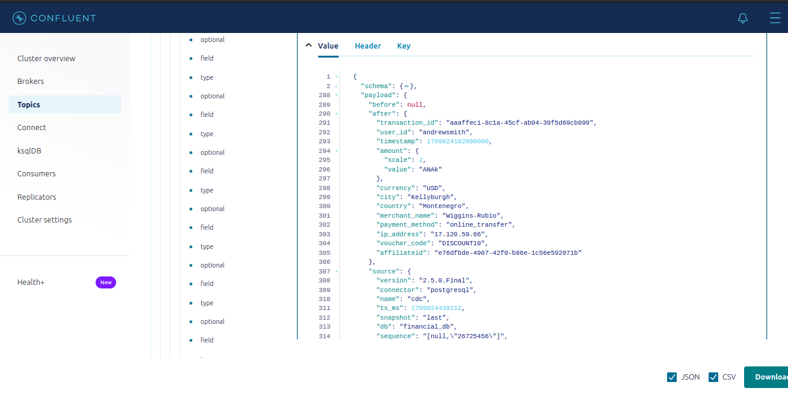
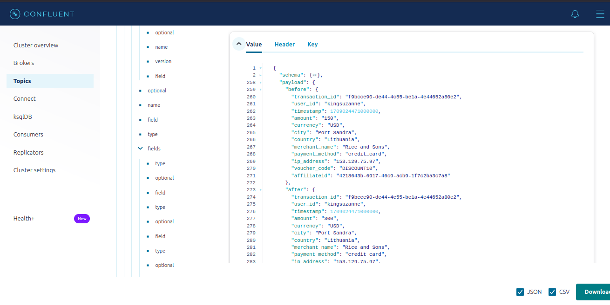
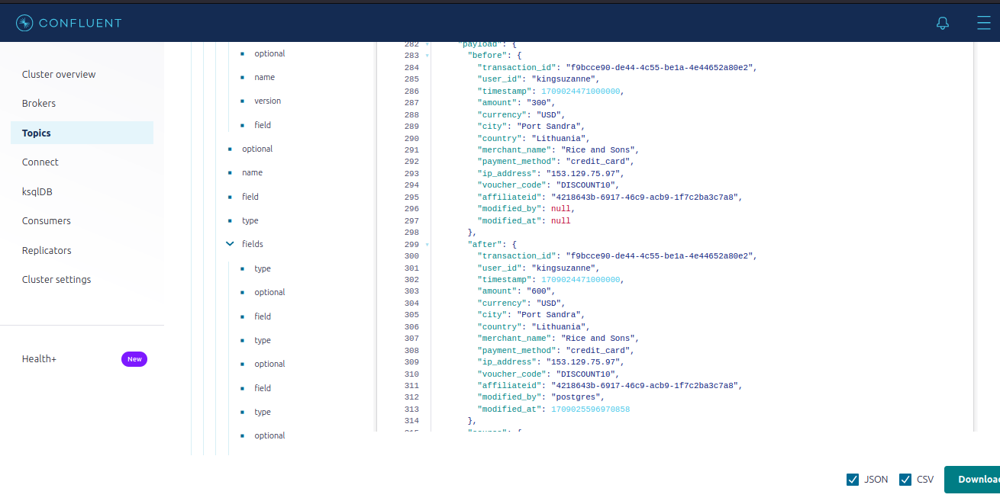
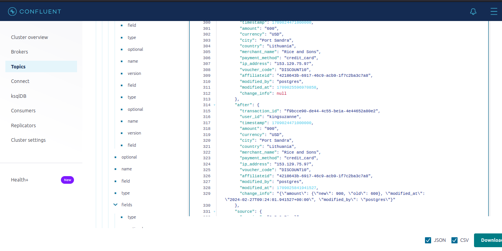

First things first, I would like to give a brief description of what stream processing entails. Streaming data enables us to recieve the data immidiately (or close to immidiately it is produced). For a stream infrastructure to be complete, there has to be the source(producers), topics(to push the data into and read data from), message(the data being sent accross) and listeners(consumers). One common tool we are going to use for streaming is Apache Kafka, whose architecture is shown below:




**Producer/Broker:** recieves the message from source

**Cluster:** the main kafka instance.

**Topic:**  data is stores awaiting to be read.

**Partitions:** includes subdivisions of a topic to organise and balance the data.


### Defining the architecture
This project utilises the following architecture as shown in the first image:

**Postgresql:** as our relational database. It can be used to store data from applications and APIs as well. Other alternatives of postgres include MySQL.

**Debezium:** which connects our relational database to our streaming platform.

**Debezium UI:** To interact with debezium using the UI.

**Kafka broker:** which recieves messages from postgres.

**Zookeper:** ensures reliability, consistency, and scalability of Kafka clusters by providing essential coordination and management services

**Control Center:** Helps us to easily interact with Kafka using the UI and view topics, read messages and so on.

Reffer to the **docker-compose.yaml** file for the whole infrastructure

Now run `docker-compose up -d` and let the containers run till they show healthy or running.

### Ingesting the data

Now that the infrustructure is all set up, we can try to put some data into our database.
To do that we  first run:

`pip install faker  psycopg2`

Faker enables us to generate fake users and populate them with data and psycopg2 enables us to connect to postgres.
Now run the **main.py** file to ingest the data.

Use the below commands to execute the postgres container and view the new data.

```
docker exec -it postgres bash

-- Once inside postgres shell
psql -U postgres -d financial_db

-- Note the username and database are picked from the docker-compose file.

-- run your queries
SELECT * FROM transactions:
```
You will get a terminal window like this one to run the select and update queries on:


**Note:** Do not close this terminal, it  will be very usefull for ruuning future update queries.

### Connect to debezium
Now you an go to debezium-ui at localhost:8080 and create a connection.
As shown in the images below:





Click next, then reveiw and finish.

Once it is successful, we shall be able to view data in form of messages via the **controlcenter on localhost:9021**. 
Click on the Topic, then **cdc.public.transactions**. Then messages, on the box next to jump to offset insert 0/Partition:0  to view the earliest messages in the topic. 
Then close the schema data to view the payload.



The amount column cannot be easily read, we shall fix that in a bit, as we create the connection via terminal by running:

```
-- enter into the debezium container
docker exec -it debezium bash

-- run the command 
curl -H 'Content-Type: application/json' localhost:8083/connectors --data '{
    "name": "postgres-connector",
    "config": {
    "connector.class": "io.debezium.connector.postgresql.PostgresConnector",
    "topic.prefix": "cdc",
    "database.user": "postgres",
    "database.dbname": "financial_db",
    "database.hostname": "postgres",
    "database.password": "postgres",
    "plugin.name": "pgoutput",
    "decimal.handling.mode": "string"
    }
    }'
```
`"decimal.handling.mode": "string"` is the new configuration we are adding to make debezium able to properly read amount column propery, since it is stored differently in debezium. The other configuration are simmilar to the json file provided after creating a connection with the UI. Our new connection will be called **postgres-connector**. You can see the change by running the update command below in the postres terminal used above:

`UPDATE transactions SET amount = amount + 150 where transaction_id = <pick_any_transaction_id_in_current_table>`

Reloading the control center should show you the current messages with the amount in digits.

### Replicate the before and after value in columns
As you notice in the current messages recieved, updating the amount value does not show us the value before update, just after. We can correct the error by running the **replicate.py** script.

The script establishes a connection to postgres then runs the alter command to allow data replication.
Run the **main.py** again to create a new transaction
Now going back to the postgres shell terminal, running the select all to get the new transaction_id and then update command on the new transaction_id then viewing the changes in the control center, by clicking the play button or refreshing, we see our new column comes with its before and after value.




### Add the modified by and modified at columns**

This can be done by running the **who_and_when.py** function makng it easy for us to know who made the updates when. Running the update command again in the postgres shell then reveiwing the messages in the Control Center we see the new changes.



### Now put everything in one column called info**
Finally we can have just acolumn which show us all the edits made above and even spesifically what was changed by running the **all_in_one_column.py** function.
Running te update command and viewing the changes again we can now kno what was changed, by who and when.



Now we are able to easily streamthe changes.

