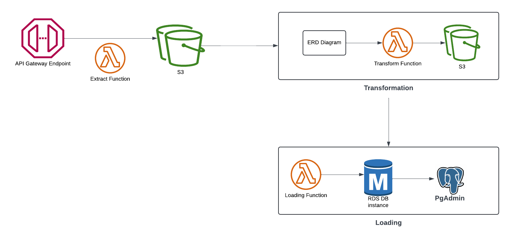
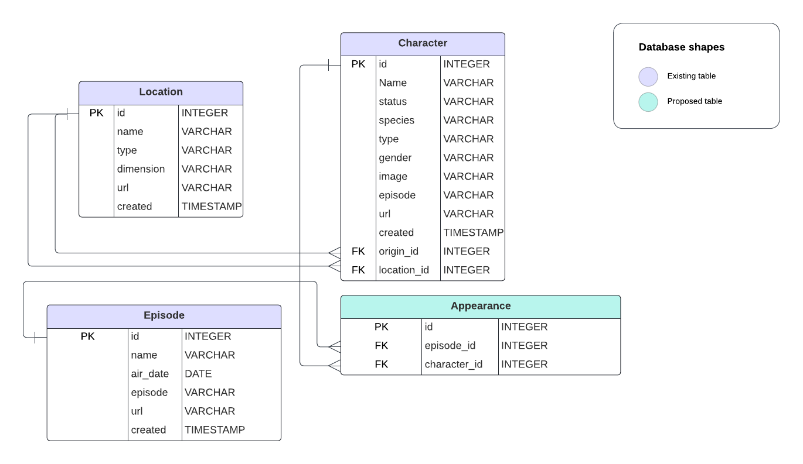

## Rick and Morty Pipeline

This project involves the creation of an ETL Pipeline to move data from [rick and morty API](https://rickandmortyapi.com) to a data warehouse.

The api consited of three main endpoints ie **Character** , **Location** and **Episodes**.

### Extraction
This process invovled writting scripts to read data from the api endpoints and store the data in various s3 buckets. For more information see [extraction notebook](extraction.ipynb) and [extraction lambda script](lambda_code/extraction.py).

**Note:** To run the script in lambda, ensure you add the Pandas layer and the [s3_file_operations file](lambda_code/s3_file_operations.py). Ensure your lambda function also has permissions to acces the s3 buckect and the s3 bucket is created before invoking the function.

### Transformation
Analysing the data we find out that we can easily create relationship within the tables and remove unnecessary columns. We thus create a data model to clearly understand the relationships as shown below and implement the script to implement the necessary transformations. 

Reffer to the [transformation notebook](transformation.ipynb) and the [script](lambda_code/tranformation.py).

### Load
Finally we load the data to an RDS Postgres db Instance to act as our warehouse.
We first create the RDS instance.
Log into it using PGADMIN and create a database that can enable us to view the current data in the DB
Excecute the [loading query](lambda_code/load.py) and query the data using PGADMIN To answer the analytical questions.
