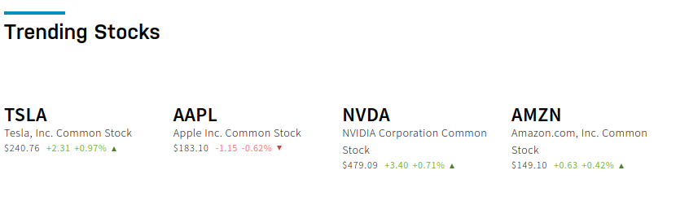

## Realtime Tesla Stock Analysis

### Overview

Tesla is ranked as the highest stock in the Nasdaq stock market, as shown in the image below.This project aims to utilize Tesla stock prices ranging from 04-01-2020 to 04-01-2024 to provide insights on trading strategies and the financial health of the stock.

### Questions the project aims to answer
- **Price trends:** Is the price trending upwards, downwards, and what is the current price of the stock?
- **Recent price movements**: What are the highest and lowest prices reached today?
- **Support and resistance levels:** Are there any significant price levels where the stock has repeatedly bounced off or failed to break through?
- **Financial heath:** Is the stock worth an investment today?
- **Trading volume:** How many shares have been traded today?
- **Unusual volume:** Is the trading volume significantly higher or lower than usual?
- **Correlation with price movements:** Is there a correlation between volume and price movements? (e.g., high volume on price increases, low volume on price decreases)

### Technologies used
- Python
- Pyspark
- Apache Kafka 
- Snowflake
- Docker(for deployment of pipelines)

### Dependancies
what is this project dependant on to run successfully

